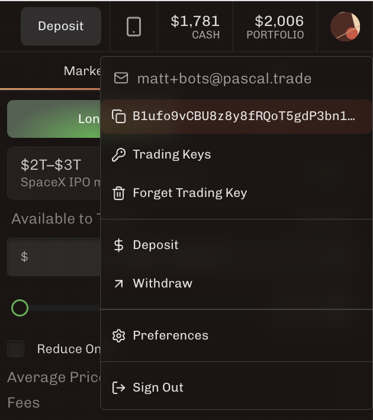
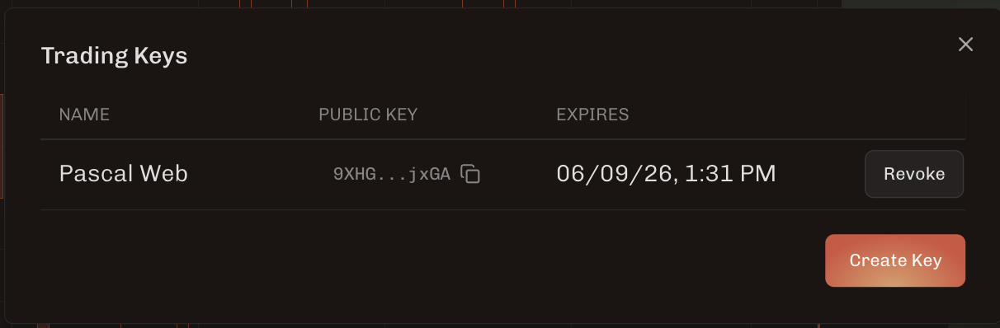

# Onboarding Through The Web App

Use this path when you can connect your wallet in the Pascal web app and
generate a Pascal trading key there.

The wallet owns the account. The trading key places and cancels orders. 
Do not use the owner wallet private key as the trading key.

## Steps

1. Copy the example environment file.

```sh
cp .env.example .env
```

2. Open the [Pascal web app](https://app.pascal.trade), connect your owner
wallet, deposit, and generate a trading key.




3. Set the owner public key.

Set `PASCAL_OWNER_PUBLIC_KEY` to the public key shown in the web app
(`B1ufo9vCBU8z8y8fRQoT5gdP3bn11UsFZUFnyxu1H7K2` in the screenshot).

4. Set the trading private key.

Set `PASCAL_TRADING_PRIVATE_KEY` to the generated trading key shown by the web
app after selecting "Create Key".

Your `.env` should have this shape:

```sh
PASCAL_OWNER_PUBLIC_KEY=<owner-wallet-public-key>
PASCAL_TRADING_PRIVATE_KEY=<generated-trading-private-key>
```

5. Verify signing and trading-key authorization.

```sh
uv run pytest tests/test_signing_vectors.py
uv run python examples/07_check_trading_key.py
```

The first command checks that the local signing code still matches Pascal's
public API examples. The second command derives the configured signer's public
key and confirms that it is active for the configured owner.

## Place An Order

After onboarding, follow
[Step 3 in the README](../README.md#step-3-place-and-cancel-an-order) to place
and cancel orders.

## Troubleshooting

See the README's FAQ entry for
[`unauthorized_signer`](../README.md#troubleshooting-unauthorized_signer).